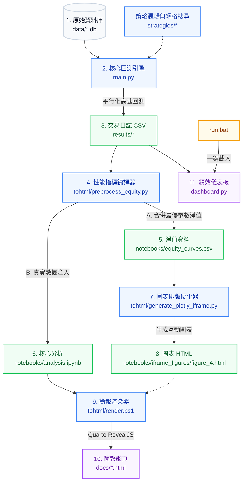

# Pairs Trading 專案開發、策略管理與自動化執行指南 (PROJECT_GUIDE)

歡迎使用 Pairs Trading 量化專案！本指南將說明專案的**整理後目錄結構**、**完整端到端執行工作流 (Workflow)**、**一鍵啟動方式**，以及如何進行策略的**新增、修訂與刪除**作業，協助您建立高效且科學的量化回測與績效比對流程。

---

## 1. 專案完整目錄結構導覽

為了保持根目錄的整潔與專案架構的清晰，本專案已完成檔案整理。所有的過期測試腳本、舊分析檔案，均已移入 archive/ 資料夾中並依日期進行分類。臨時開發腳本則存放在 tmp/ 中。以下是整理後的最新專案結構：

```text
pairtrade_trainingproject/
├── .vscode/               # VS Code 開發環境配置（設定檔、除錯、自訂任務）
├── Project/               # Python venv 虛擬環境（已在 .gitignore 中排除）
├── src/                   # 共享核心模組目錄（預留給未來共用邏輯，已支援 Editable Install）
│   └── __init__.py
├── strategies/            # 核心配對交易策略邏輯實作目錄
│   ├── __init__.py
│   ├── ssd_basic.py       # 1. 經典 SSD (Basic) 距離策略
│   ├── ssd.py             # 2. 進階 SSD (OLS) 殘差滾動策略
│   ├── HDBSCAN.py         # 3. HDBSCAN 分群策略 (支援 UMAP / PCA 降維)
│   ├── HDBSCAN_Autoencoder.py # 4. HDBSCAN + 深度學習自編碼器 (AE) 特徵提取策略
│   └── HDBSCAN_MultiFactor.py # 5. HDBSCAN 多因子分群策略
├── fetch/                 # 數據下載與維護模組 (SP500_Tiingo.py, SP500_yf.py 等)
├── data/                  # 歷史價格與成分股資料庫目錄
│   ├── SP500_Current.db   # 現行 S&P 500 成分股價格資料庫 (SQLite)
│   ├── sp500.db           # 完整歷史 S&P 500 生存者偏誤修正資料庫
│   └── imputed_sectors.csv # 補缺後的行業分類對照表
├── results/               # 存放所有策略回測結果與日誌
│   ├── current/           # 現行成分股回測輸出目錄（包含各子策略資料夾）
│   └── full/              # 完整歷史成分股回測輸出目錄
├── notebooks/             # Jupyter Notebooks 實驗與研究簡報目錄
│   ├── analysis.ipynb     # 核心分析與六大策略最優參數對比 Notebook
│   ├── equity_curves.csv  # 由編譯程式產出的六大最優策略淨值合併 CSV
│   ├── styles.scss        # RevealJS 簡報自訂樣式設定
│   └── iframe_figures/    # 存放嵌入式互動 Plotly HTML 圖表 (figure_4.html)
├── tohtml/                # Jupyter Notebook 轉 HTML / Slides 報告工具包 (僅保留核心 Python 腳本)
│   ├── preprocess_equity.py # [核心編譯器] 自適應編譯最優淨值並自動注入注入 analysis.ipynb 表格
│   └── generate_plotly_iframe.py # 優化 Plotly 排版並生成 figure_4.html
├── docs/                  # 靜態 HTML 簡報與文檔輸出目錄 (Quarto 輸出與 GitHub Pages 部署來源)
│   ├── index.html         # 簡報索引首頁
│   └── *.html / *_files/  # 由 render.bat 產生、自定義名稱的簡報與依賴檔案
├── ref/                   # 學術文獻與經典論文庫 (共 23 篇 PDF 檔)
├── archive/               # 歷史存檔與過期分析檔案目錄 (依日期/月份分類，如 114/, 11505/, 11506/)
├── Ref_CODE/              # 過往參考程式碼、試算表與對照結果備份
├── tmp/                   # 臨時腳本與防禦性論證輔助工具目錄
├── dashboard.py           # Streamlit 績效比對 Dashboard 應用程式 (視覺化核心)
├── main.py                # 核心回測引擎 (支援多行程平行計算、網格搜尋與智慧斷點續傳)
├── requirements.txt       # 專案相依 Python 套件清單
├── pyproject.toml         # 專案套件配置檔 (用於本地模組 Editable 安裝)
├── setup.bat              # [一鍵工具] 專案環境初始化與套件安裝
├── run.bat                # [一鍵工具] 一鍵啟動 Streamlit Dashboard
└── render.bat             # [一鍵工具] [新/移入根目錄] 一鍵編譯與自定義簡報發佈至 docs/
```

---

## 2. 完整端到端執行工作流 (Workflow)

專案提供了一套科學且高度自動化的完整執行流程。下圖展示了從**原始數據載入**到**最終簡報與視覺化儀表板**的端到端數據流向：



### 🏃 執行生命週期步驟說明：

#### 步驟 1：環境初始化 (`setup.bat`)
* **執行方法**：按兩下根目錄的 `setup.bat`。
* **功能**：自動建立虛擬環境 `Project/`，升級 pip，安裝 `requirements.txt` 中所有的量化、機器學習與自編碼器所需套件，並以開發者模式 (`pip install -e .`) 註冊本地 `src` 模組，確保跨策略調用暢通無阻。

#### 步驟 2：平行化回測與參數網格搜尋 (`main.py`)
* **執行方法**：
  ```bash
  # 啟動互動選單（選擇資料集、是否允許停損再進場、是否啟用波動率調節）
  python main.py
  # 或使用完全靜態的 CLI 參數直接在後台執行：
  python main.py --db sp500_Current --allow-reentry --workers 4
  ```
* **功能**：
  * **單次 I/O 加載**：在主進程中一次性讀取 SQLite 資料庫並進行 Pivot 矩陣轉換，避免子行程重複讀寫硬碟。
  * **多行程並行**：調用進程池並行執行六大策略的滾動回測。
  * **網格優化**：針對 `Top N [5, 10, 20]`、`Stop Loss [0%, 5%, 15%]`、`Z-Window [0]` (固定為 0)、`PSL [0%, 10%, 20%]` (全域動態停損)、`MSR [0%, 3%]` (配對產業上限) 與 `DSZ [0, 3, 5]` (部位動態停損) 等 7 組參數進行科學網格搜尋與高效外部產業切片過濾。
  * **智慧斷點續傳**：自動檢測策略代碼、資料庫檔案與網格參數是否修改，若無變動則自動跳過，極速節省運算資源。

#### 步驟 3：最優參數淨值合併與指標編譯 (`preprocess_equity.py`)
* **執行方法**：
  ```bash
  python preprocess_equity.py
  ```
* **功能**：
  * 自動掃描 `results/` 資料夾，篩選出六大策略的最佳參數組合。
  * 計算出與 `dashboard.py` 100% 精準對齊的量化指標（包含最終淨值、年化報酬率、夏普值、最大回撤、RCC 與實際動用保證金收益率 REC）。
  * 合併最優淨值曲線並導出至 `notebooks/equity_curves.csv`。
  * **動態 Notebook 改寫**：直接將最新、真實的 HTML 績效對比表格動態注入到 `notebooks/analysis.ipynb` 中，無需手動複製。

#### 步驟 4：互動 Plotly 圖表生成與簡報渲染 (`tohtml/generate_plotly_iframe.py` 與 `tohtml/render.ps1`)
* **執行方法**：
  在 PowerShell 中執行：
  ```powershell
  cd tohtml
  .\render.ps1
  ```
* **功能**：
  * 執行 `generate_plotly_iframe.py`：讀取 `equity_curves.csv`，移除重疊的內部標題，設定優雅的 Inter 字體與配色，產出雙通道（可隨選 Current/Full 數據）的互動式 Plotly 圖表 `notebooks/iframe_figures/figure_4.html`。
  * 執行 `quarto render`：一鍵將 `notebooks/analysis.ipynb` 渲染成高質感的 RevealJS HTML 簡報，輸出至 `docs/` 資料夾，作為學術報告與進度展示使用。

#### 步驟 5：啟動 Streamlit 績效比對儀表板 (`run.bat`)
* **執行方法**：按兩下根目錄的 `run.bat`。
* **功能**：啟動 Streamlit 本地伺服器，自動在瀏覽器中開啟 `http://localhost:8501`。
* **亮點**：
  * 提供多維度 Filter（資料集、重入機制、波動調節、策略方法、配對數、停損率、Z-Window）。
  * 實時繪製多達 5 個策略的淨值曲線對比。
  * **Deep Dive 功能**：可逐期（Period）查看交易標的，點擊特定配對即可叫出 **Trade Visualizer**，動態還原該配對的買入（Buy Long）、賣空（Sell Short）、平倉（Close）以及停損（Stop Loss）的所有時點與價格折線！

---

## 3. 策略 CSV 資料對接規範 (Data Contract)

Dashboard (`dashboard.py`) 與編譯器 (`preprocess_equity.py`) 是透過掃描 `results/` 目錄下的 CSV 檔案來進行績效分析與對比的。回測產出的 CSV 檔案必須嚴格符合以下規範：

### 3.1 檔名特徵解析規則
系統會遞迴掃描檔名包含 **`TradeLogs`** 或 **`detailed_trade_logs`** 的 CSV 檔案，並透過檔名關鍵字自動解析特徵：

| 特徵欄位 | 規則 (不分大小寫) | 範例與解析結果 |
| :--- | :--- | :--- |
| **DATASET** | 包含 `full` $\rightarrow$ `Full`<br>包含 `current` $\rightarrow$ `Current`<br>包含 `quick_test` $\rightarrow$ `Quick_Test`<br>其他 $\rightarrow$ `Unknown` | `strategy_full_TradeLogs.csv` $\rightarrow$ **Full** |
| **RE-ENTRY** | 包含 `noreentry` $\rightarrow$ `NoReEntry`<br>包含 `reentry` $\rightarrow$ `ReEntry`<br>其他 $\rightarrow$ `Unknown` | `SSD_noreentry_TradeLogs.csv` $\rightarrow$ **NoReEntry** |
| **METHOD** | 包含 `ssd_basic` $\rightarrow$ `SSD (Basic)`<br>包含 `ssd` $\rightarrow$ `SSD`<br>包含 `eg` $\rightarrow$ `EG`<br>包含 `hdbscan` 且 `multifactor` $\rightarrow$ `HDBSCAN (MF)` (MultiFactor)<br>包含 `hdbscan_ae_pca` 或包含 `_ae_` 且 `_pca_` $\rightarrow$ `HDBSCAN (AE PCA)`<br>包含 `hdbscan_ae` 或單純有 `_ae_` $\rightarrow$ `HDBSCAN (AE UMAP)`<br>包含 `hdbscan_pca` 或單純有 `_pca_` $\rightarrow$ `HDBSCAN (PCA)`<br>其他 `hdbscan` 相關 $\rightarrow$ `HDBSCAN (UMAP)` | `eg_reentry_TradeLogs.csv` $\rightarrow$ **EG**<br>`hdbscan_ae_pca_TradeLogs.csv` $\rightarrow$ **HDBSCAN (AE PCA)** |
| **TOP N** | 正則匹配 `top(\d+)` | `top5` $\rightarrow$ **Top 5**（預設為 Top 20） |
| **STOP LOSS %** | 正則匹配 `sl(\d+)` | `sl5` $\rightarrow$ **5%**（預設為 0%） |
| **Z-WINDOW** | 正則匹配 `zwin(\d+)` | `zwin0` $\rightarrow$ **0**（固定為 0） |
| **PSL % (全域停損)** | 正則匹配 `psl(\d+)` | `psl10` $\rightarrow$ **10%**（0% 為無全域停損） |
| **MSR % (產業上限)** | 正則匹配 `msr(\d+)` | `msr3` $\rightarrow$ **3%**（0% 為無產業上限） |
| **DSZ (動態停損)** | 正則匹配 `dsz(\d+)` | `dsz3` $\rightarrow$ **3.0**（0 為不停損） |
| **VOL (波動度調節)** | 包含 `voladj` $\rightarrow$ `有`<br>包含 `novol` $\rightarrow$ `無` | `novol` $\rightarrow$ **無** |

> 💡 **最佳命名格式建議**：
> `results/[DATASET]/[METHOD]_[REENTRY]/TradeLogs_top[N]_sl[SL]_zwin[Z]_psl[PSL]_msr[MSR]_dsz[DSZ]_[VOL].csv`
> * 實例：`results/current/HDBSCAN_UMAP_NoReEntry/HDBSCAN_UMAP_TradeLogs_Top5_SL5_ZWin0_PSL10_MSR3_DSZ3_NoVol.csv`

### 3.2 CSV 必備欄位結構
回測 CSV 檔案中，請務必包含並精確命名以下欄位：
* `Date` (格式: `YYYY-MM-DD`) - 交易日期
* `Position` (數值, 例如 `1`, `0`, `-1`) - 持倉狀態
* `Ticker_A`, `Ticker_B` - 交易配對標的代號
* `Daily_Delta` (數值) - 每日 PnL 損益變化量（用以計算累計權益曲線、年化報酬率與 Sharpe Ratio）
* `Status` (字串, 如 `Stop Loss`、`Normal Exit` 或 `停損`) - 交易結束狀態（若包含 `stop`、`sl` 或 `停損`，會被統計入 Stop Losses 次數）
* `Hedge_Ratio` - 配對避險比例 (OLS 或 EG 計算之 Beta)
* `Price_A`, `Price_B` - 標的價格（用以進行單對 Trade Visualizer 繪圖）
* `Days_Held` - 持倉天數
* `Period_Start`, `Period_End` - 該配對所屬的交易週期起訖時間

---

## 4. 策略管理標準作業程序 (SOP)

### ➕ 4.1 新增策略作業
1. **策略代碼開發**：在 `strategies/` 下新建您的策略 Python 模組（例如 `my_strategy.py`），並實作 `run_strategy` 標準接口。
2. **註冊回測任務**：開啟 `main.py`，在 `main()` 函數中的 `strategies_raw` 列表中添加您的策略配置與網格搜尋參數。
3. **執行回測**：運行 `python main.py`，產出對應的 Trade Logs CSV。
4. **指標編譯**：運行 `python tohtml/preprocess_equity.py`，將新策略的最優曲線編譯進 `equity_curves.csv` 並更新 `analysis.ipynb` 表格。
5. **啟動儀表板**：重啟或重新整理 Streamlit，即可在界面中勾選並比對新策略的效能！

### 📝 4.2 修訂策略作業
如果您修改了策略邏輯或調整了回測參數：
1. **執行回測與覆寫**：重新運行 `main.py`。智慧斷點機制會自動識別代碼或參數的變更，強制重新計算並覆寫 `results/` 下的舊 CSV 檔案。
2. **⚠️ 關鍵步驟：清除 Dashboard 快取**：
   * 由於 Dashboard 使用了 Streamlit 記憶體快取技術 (`@st.cache_data`) 來加速巨量數據的讀取，**單純重新整理網頁是不會讀入更新後的 CSV 資料的！**
   * **清除快取方法**：在 Streamlit 網頁右上角點選三個點的選單 $\rightarrow$ 點擊 **"Clear cache"**（或直接在網頁畫面上按下鍵盤的 **`C`** 鍵）並點擊確認。

### ❌ 4.3 刪除策略作業
當某些舊策略不再需要進行績效比對時：
1. **移除檔案**：
   * 開啟 `results/` 目錄，直接刪除不需要的 CSV 檔案或整個子策略資料夾。
   * *(推薦備份做法)* 將不需要的 CSV 移至根目錄的 `archive/` 中（建議依日期/月份分類放置，例如 `11506/`）。由於 Dashboard 與編譯器只會掃描 `results/`，移出此目錄的檔案將不會被載入。
2. **清除 Dashboard 快取**：在 Streamlit 介面上按下鍵盤的 **`C`** 鍵清除快取，已刪除的策略就會完全從 Dashboard 與選單中消失。

---

## 5. 學術與參考資源

* **學術論文庫 (`ref/`)**：專案收集了從 2006 年至 2025 年共 23 篇經典的配對交易與機器學習論文（如共整合 Copula 方法、無監督學習配對、以及強化學習配對交易模型），為本專案的策略設計（如 HDBSCAN 與自編碼器）奠定了深厚的理論基礎。
* **參考程式碼 (`Ref_CODE/`)**：包含了專案開發初期的原型程式碼（DTW 配對、經典 SSD 策略等）與二十年歷史股價 Excel 對照表，供策略開發與正確性驗證時查閱。
